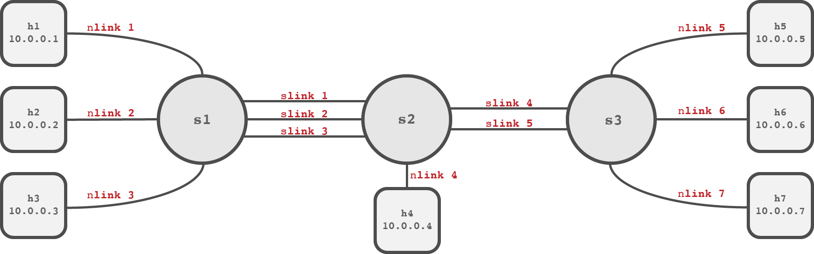

# Coursework: ECMP Switch [load balancer]

In this coursework you will be expected to produce:
  - A Mininet topology conforming to a given description
  - JSON data files that relate to the created topology
  - A Ryu-based OpenFlow controller that enables ECMP switching
    - A RESTful API to manage the controller

> 📚 You are expected to have completed the recommended tutorials from the
> SCC365 GitHub prior to starting this coursework:
>   - [Mininet Tutorial](https://github.com/scc365/tutorial-mininet)
>   - [Ryu Tutorial](https://github.com/scc365/tutorial-ryu)

---

## Important Information

- ⏱ **Deadline**: Friday Week 16 (4pm)
- ✅ **Marking**: Book a marking slot to take place in Week 17
- ⚖️ **Weight**: 50% of the coursework grade
- 🗣 **Language**: Python
- ⏳ **Estimated Time**: 4+ hours

---

## Overview

Load balancing is a popular mechanism to improve network capacity, without
investing on expensive equipment upgrades. The mechanism exploits link
redundancy and forwards traffic between two end-points, using multiple diverse
paths.  Theoretically, load balancing techniques can achieve an additive effect
on the overall throughput under certain conditions (e.g. you can combine two
1GbE links and achieve a throughput of up to 2Gbps). Load balancing can be
implemented in multiple layers of the network. [Equal-Cost Multiple Path (ECMP)
Routing](https://datatracker.ietf.org/doc/html/rfc2992) is one of the first
attempts to standardize load balancing in the link layer and several network
standards (e.g. IETF TRILL) and products (e.g. Cisco UCMP) use ECMP for load
balancing. In this coursework, we are going to explore how load balancing can be
implemented by a network switch, using the OpenFlow protocol.

Implementing load balancing on the link layer requires a set of extensions on
the basic learning switch design seen in the solution to the [Ryu
Tutorial](https://github.com/scc365/tutorial-ryu):

  - **Virtual Ports**: When a network contains loops, an ECMP switch cannot
    simply rely on the original Layer 2 Learning (L2L) switch, since only the
    most recently learned path will be used (learning implementation dependent).
    To mitigate this issue, an ECMP switch can use __Virtual Ports__, where a
    virtual port is simply a set of 1 or more physical ports that all go
    directly to the same end-point. Then similar to an L2L switch, a MAC to port
    mapping table can be constructed, however associating MAC addresses with
    virtual ports. There are multiple ways in which virtual ports should be
    used.
    - To avoid packet storms. When a L2L switch does not yet have a port mapping
      for a given destination MAC address, it floods packets (transmit the
      packet to all port, except the incoming). This action creates several
      packet replicas, which via the loop will reach the original switch and
      will get flooded again. The number of unnecessary retransmissions grows
      exponentially over time, until the switches discover a valid path. To
      mitigate this, packets should only be flooded though all virtual ports.
    - To forward. When forwarding a packet, an approach very similar to that of
      an L2L switch can be used. However, as the map associates MAC addresses
      with virtual ports, the forwarding logic needs to select a physical port
      to actually send the packet out of. This is typically determined by a load
      balancing algorithm (most often a hashing or round-robin), but regardless
      of algorithm _flow consistency_ must be maintained. When forwarding a
      packet via a virtual port, it is important to understand that the virtual
      port is simply an abstraction layer in the switch logic, so whenever
      communication with a switch via the OpenFlow protocol requires a port
      number, only a physical port number should be sent.

  - **Flow Consistency**: When load balancing across multiple equal cost paths
    it can seem logical to forward packets in a round-robin (loop around the
    valid group) fashion between ithe available physical ports in the associated
    virtual port. However, this may cause many unnecessary packet
    retransmissions and packet storms and in general, have a negative impact on
    network performance (Think how 3DUP ACK will behave if one of the
    alternative paths has a high RTT). Instead, all packets that are part of a
    given flow should be transmitted via the same physical port. To do this, the
    switch needs to:
    1. To be able to determine a flow, the switch must create a flow identifier
       for each incoming packet. The most common implementation of this is the
       five-tuple. This consists of the source and destination IP addresses, the
       IP protocol, and the source and destination transport layer (UDP, TCP)
       ports. Packets in the same flow will have the same five-tuple.
    2. Once a flow is determined, the optimal physical port in the virtual port
       must be selected. To load balance via a round-robin algorithm, the switch
       must keep track of which flows have already been transmitted via a port
       in the group, and if the packet to be forwarded is part of an already
       seen flow, it should be transmitted out of the same port. However, if not
       seen the next physical port in the virtual port is used and the flow is
       added to the data structure storing seen flows.  However, if the virtual
       ports can not be changed during the runtime of the switch, the switch can
       use a hashing load balancing algorithm where it need not keep track of
       which flows have been transmitted via a given port. In this, the found
       five-tuple is hashed and the value of that hash determines which port
       that flow will use. As putting the same data though the same hash
       function will always result in the same answer, it is ensured that
       packets of the same flow will be assigned the same physical port.

## Tasks

This coursework is split into 4 tasks that expand on each other. You do **not**
need to separate tasks into separate documents, the task split is only here to
help you divide up your work and to make each part of the work distinct when
marking. For more about marking, see [here](#marking-guidance) and take note of
the marks allocated to each task.

You are not expected to start from scratch for this coursework. A template is
provided on Moodle that implements a L2L switch and also contains some currently
unused functions that will help you with this coursework task. Your solution is
not require to user the provided API, but the functions can help you to better
organize your code. 

### Task 1: The Topology

[**20 marks**]

> 📚 Complete the [Mininet Tutorial](https://github.com/scc365/tutorial-mininet)
> before starting this task!

To be able to build a ECMP switch, you will need a network with redundant paths
to test it on. You should produce a topology that uses Mininet (specifically
`mn`) and matches the diagram and table below:



The `nlink`s in the topology should have no constrains applied. However, the
`slink`s in the topology should have the following constraints applied using
`TCLink`: 

|    Links    |           Constraints            |
| :---------: | :------------------------------: |
| `1`,`2`,`3` | Bandwidth: `100Mbps` Delay=`5ms` |
|   `4`,`5`   | Bandwidth: `50Mbps` Delay=`10ms` |

You should test your topology both using the `mn` command line tool on the
provided VM. Also, you can use the [`me`](https://scc365.github.io/me) app to
better visualize your topology!

> 📝 **Note**: There is not much you can do to make a particularly efficient
> topology, however, you are expected to keep a high standard of code elegance
> here

Remember to use tools such as
[`ping`](https://github.com/scc365/guide-network-testing/blob/main/ping/PING.md)
and
[`iperf`](https://github.com/scc365/guide-network-testing/blob/main/iperf/IPERF.md)
to test your topology.

#### Virtual Ports

To avoid packet storms, the controller must be aware of which ports on a given
datapath link to the same node in order control the ports used in flooding. This
data can be complicated to determine programmatically within the controller
itself. So for this task, you should also create a corresponding JSON file that
defines a set of _virtual ports_ for each datapath ID. A virtual port in this
context is an arbitrarily named list of physical ports on the datapath that all
directly go to the same host. For example, in the topology described for this
task, 3 ports on datapath `s2` link to `s1`, and so should be grouped into a
virtual port.

The file should be named `vports.json` and take the format:

```json
{
  "<datapath id>": {
    "<virtual port name>": []
  }
}
```

So the example below would be a valid `vports.json` file for a topology where
the only multipath link is the virtual port `VP1` on datapath `0000000000000001`
and `VP1` can use physical ports 1, 2, or 3:

```json
{
  "0000000000000001": {
    "VP1": [1, 2, 3]
  }
}
```

You do not need to define ports where there is only a single link to a given
host as a virtual port (meaning all virtual ports should pair with a list no
smaller than 2 ports).

You can manually create the `vports.json` file contents, or you can use the
`vports.py` tool provided in the template. Use this tool with the `--custom` and
`--topo` flags you would use with `mn`, for example:

```bash
python3 vports.py --custom ./topology.py --topo tutorialTopology
```

### Task 2: Safe Flooding

[**40 marks**]

> 📚 Complete the [Ryu Tutorial](https://github.com/scc365/tutorial-ryu) before
> starting this task!

A Layer 2 Learning (L2L) switch always floods packet when a destination MAC
address that is not in the mappings table. Nonetheless, sending a packet out on
all ports is inefficient, however does ensure the packet will reach the
destination (assuming the destination is real and on the network).
Unfortunately, complications arise when loops exist within a network and packet
storms are a common symptom of unchecked loops, often monopolizing all the
resources in a network. Protocols such as the Spanning Tree Protocol (STP) can
remove these problems, however do prevent devices from exploiting the benefits
that redundant links may offer.  The topology created [task
1](#task-1-the-topology) does have redundant links that can cause the
above-mentioned issues. Luckily however, the `vports.json` file also produced in
[task 1](#task-1-the-topology) along with datapath port description
[requests](https://ryu.readthedocs.io/en/latest/ofproto_v1_3_ref.html#ryu.ofproto.ofproto_v1_3_parser.OFPPortDescStatsRequest)
and
[responses](https://ryu.readthedocs.io/en/latest/ofproto_v1_3_ref.html#ryu.ofproto.ofproto_v1_3_parser.OFPPortDescStatsReply)
can be used by the controller to avoid dangerous flooding.

For this task, you must modify the logic of the learning switch application and
ensure that packets are not flooded via all ports (`OFPP_FLOOD`), if the
associated datapath has redundant links. Instead, use information from the port
description requests/replies to create a list with the ports that the  datapath
should use when flooding. For example, if a datapath had 5 ports, and port `2`
and `3` were found to be in a _virtual port_ group, a valid list of ports for
flooding could look like `1`, `2`, `4`, `5` or `1`, `3`, `4`, `5`.

At this point, your controller should work as an L2L switch, it will be
acceptable to use a single forwarding path between two end-points, even if
redundant links exist between switches. 

### Task 3: ECMP Forwarding

[**20 marks**]

Although safe flooding can forward traffic across a network with redundant
links, end-hosts cannot exploit any performance gains from it. To increase
network capacity, the ECMP switch must balance load across the redundant links,
thus increasing the available bandwidth between any 2 nodes.

For this task, the `vports.json` data should be utilized to load balance traffic
across links when there are multiple equal-cost paths. It is important to
remember that when load balancing, it is **packet flows** that should be spread
across links (not just individual packets) in order to maintain [flow
consistency](#overview). To do this, the controller should determine a packet's
flow using a five-tuple.

You can test the ECMP forwarding behavior using `iperf3` with parallel streams.
For more on this, see the [`iperf3`
guide](https://github.com/scc365/guide-network-testing/blob/main/iperf/IPERF.md).

This approach to implement load balancing can also be optimized using Flow Table
modifications (Flow Mods). Specifically, the relevant Flow Table entries will
apply packet forwarding decision in the data plane.

### Task 4: RESTful Management API

[**20 marks**]

SDN technologies improve the interoperability of the network with other software
entities. This does however require the controller to expose functions or
network information in a medium that can be accessed and parsed by other
applications. REST uses HTTP and JSON to expose data and functions to do just
that.

The provided controller template for this coursework has 4 REST endpoints found
in the `ControllerAPI` class. These are as follows:

  - **route**: `/api/info` 
    - **method**: GET 
    - **description**: Gather some basic information about the Ryu controller 
    - **path params**: N/A 
    - **returned fields**:
      - **class**: The name of the Python class that is the controller
      - **functions** (`list`): A list of available functions within that class


  - **route**: `/api/datapaths` 
    - **method**: GET 
    - **description**: Determine the datapaths seen by the Ryu controller 
    - **path params**: N/A 
    - **returned fields**:
      - A list of datapath IDs


  - **route**: `/api/mappings` 
    - **method**: GET 
    - **description**: Find out what layer 2 mappings have been created thus far 
    - **path params**: N/A 
    - **returned fields**:
      - **datapath id** (`list`): The datapath ID with it's associated mappings
        - **mac address** (`list`): The MAC address with its associated port number


  - **route**: `/api/mappings/{dpid}` 
    - **method**: GET 
    - **description**: Find out what layer 2 mappings have been created thus far
    for just a single specific datapath 
    - **path params**: 
      - **dpid**: The datapath ID for the mappings table desired (in full)
    - **returned fields**:
      - **mac address** (`list`): The MAC address with its associated port number
    - **error**: This can return an error. See the code for more details...

For this task, expand the functionality of the given API by adding the following
endpoints:

  - **route**: `/api/virtualports` 
    - **method**: GET 
    - **description**: Gather what the controller parsed from the `vports.json`
      file, exactly as read from the file 
    - **path params**: N/A 
    - **returned fields**:
      - **datapath id** (`list`): The datapath ID with it's associated vports
        - **vport name** (`list`): The name of the vport with its associated physical
          port number list
  
  - **route**: `/api/virtualports/{dpid}` 
    - **method**: GET 
    - **description**: Gather what the controller parsed from the `vports.json`
      file, exactly as read from the file for just a single specific datapath 
    - **path params**: 
      - **dpid**: The datapath ID for the `vports` table desired (in full)
    - **returned fields**:
      - **vport name** (`list`): The name of the vport with its associated physical
          port number list 
    - **error**: This should return an error if the datapath does not exist

  - **route**: `/api/ports/{dpid}/{port}/stats` 
    - **method**: GET 
    - **description**: Get some port statistics for a given physical port on a
      given datapath
    - **path params**: 
      - **dpid**: The datapath ID that the port belongs to (in full)
      - **port**: The number of the physical port on the datapath 
    - **returned fields**:
      - **txPackets**: The number of packets transmitted via this port
      - **rxPackets**: The number of packets received via this port
      - **txBytes**: The number of bytes transmitted via this port
      - **rxBytes**: The number of bytes received via this port
    - **error**: This should return an error if the datapath or port does not exist

  - **route**: `/api/virtualports/{dpid}/{vport}/stats` 
    - **method**: GET
    - **description**: Get some port statistics for a given virtual port on a
      given datapath 
    - **path params**: 
      - **dpid**: The datapath ID that the port belongs to (in full)
      - **vport**: The name of the virtual port on the datapath 
    - **returned fields**:
      - **txPackets**: The number of packets transmitted via this vport
      - **rxPackets**: The number of packets received via this vport
      - **txBytes**: The number of bytes transmitted via this vport
      - **rxBytes**: The number of bytes received via this vport
    - **error**: This should return an error if the datapath or vport does not exist

You should follow typical REST guidelines for these endpoints, for example,
using a vaguely correct (`400`, `500`) error code with error responses, along
with providing some context in the body of an error.

Remember, you can use
[`curl`](http://manpages.ubuntu.com/manpages/focal/man1/curl.1.html) to test
your API by generating `http` get requests.

## Submission

When submitting your work you should have the following files:

  - **`topology.py`**: The file containing the Python script used by `mn` to
    create the topology
  - **`vports.json`**: The file containing the virtual port mappings for your
    topology
  - **`ecmp.py`**: The main file for your ECMP switch Ryu controller used by
    `ryu-manager`

And you may also provide the following files if necessary:

  - **`*.py`**: Any other separated Python files needed by your controller code
  - **`requirements.txt`**: A set of extra Python (`pip`) modules needed for
    your controller
  
## Marking Guidance

Although this coursework results in a single grade in your transcript, each task
will be marked separately. This means that the marks for a task will be awarded
regardless if you complete a higher/lower numbered tasks. For each task we will
evaluate the following aspects:

  - Functionality (40%): Does task provide the expected functionality to the
    switch in all test cases?
  - Efficiency (20%): Is the functionality implemented in an optimal way?
  - Elegance (20%): How well written/neat is the submitted code? 
  - Knowledge (20%): An evaluation of your knowledge on both the topic of the
    work, and your knowledge of your submitted solution.
